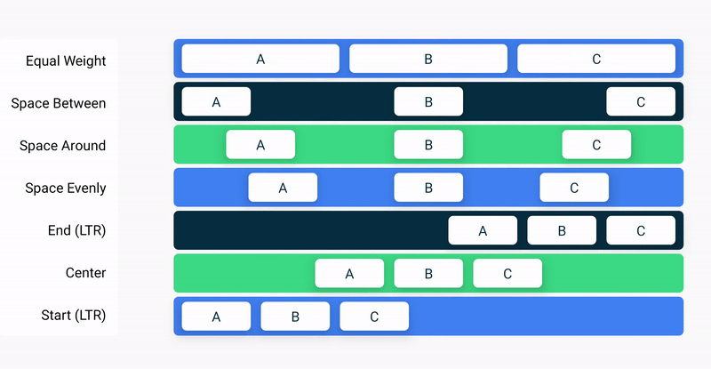
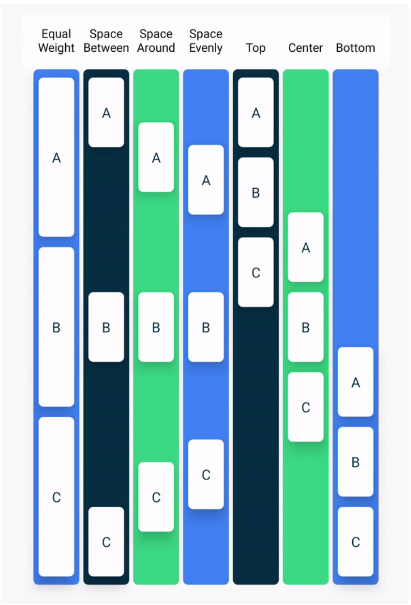

# Jetpack Compose

## 텍스트 컴포저블로 간단한 앱 빌드

### Jetpack Compose란 무엇인가요?
- Android UI를 빌드하기 위해 사용하는 최신 툴킷
- 적은 양의 코드
- 직관적인 Kotlin 기능 : UI 개발을 간소화 및 가속

#### Composable
- UI 일부를 설명
- 반환 값 
- 입력을 통해 화면에 표시되는 내용 생성
- 여러 UI 요소를 내보낼 수 있음

#### Annotation
- 코드에 추가 정보를 첨부하는 방법
- 매개변수를 넣을 수 있음

#### Composable의 예시
- 모든 Composable function에는 **@Composable**이 존재해야 한다.
    - Annotation은 데이터를 UI로 변환한다고 Compose Compiler에게 알림
    - Compiler는 기계어로 변환하는 특수한 프로그램(자바의 경우 바이트코드로 변환)

#### Composable func 네이밍
- 명사여야 한다 : DoneButton()
- 동사면 안된다 : DrawTextField() 
- 전치사가 명사화된 것은 안된다 : TextFieldWithLink()
- 형용사도 안된다 : Bright()
- 부사도 안된다 : Outside()
- 명사 앞에 형용사를 붙이는 것은 가능하다 : RoundIcon()

### 글꼴 크기 변경 
- SP (Scale-Independent Pixels) : 시스템 사이즈의 따라 변경
- DP (Density-Independent Pixels) : 화면의 크기가 달라도 동일한 비율

### 행과 열에 텍스트 요소 정렬

#### Compose의 3가지 표준 레이아웃 요소
- Column
- Row
- Box

--- 

## Android 앱에 이미지 추가

### 이미지 컴포저블 추가
- painterResource() : drawable file의 이미지를 가져옴

### Box layout 추가

#### Box
- 요소들을 서로 위에 쌓을 수 있음
- 정렬 가능

### 이미지 Composable의 위치 지정 및 크기 조정

#### Modifier
- Composable이 매개변수로 허용해야 사용가능
- 배경 지정
- padding 지정
- 동작 추가
- fillMaxHeight, fillMaxWidth : 높이, 너비 채우기

#### ContentScale
- ContentScale을 이용하여 이미지의 비율 조정 가능
- ContentScale.Crop

### 텍스트 정렬 및 패딩 추가
- fillMaxWidth : 너비를 끝까지 채울 수 있는 공간을 만듬
- wrapContentWidth : 채울 수 있는 공간 내에서 자신의 너비만큼 채움
    - 정렬 가능
    - 매개 변수에 Alignment.Start, Alignment.Top, Alignment.End, Alignment.Bottom을 넣어 정렬 가능
- padding은 Modifier를 통해 사용이 가능

### 적절한 코드 사례 채택

#### 번역
- 하드코딩된 String은 번역이 어렵다. 따라서, String Resource로 구분해준다.

---

## 연습 Compose 기본 사항
- ContentScale을 Fit으로 설정해야 이미지 크기가 알맞게 떨어진다.
- Column 안의 자식 뷰들의 정렬을 위해서는 다음 2가지를 사용해야한다.
    - verticalArrangement(Column), verticalAlignment(Row)
    - horizontalAlignment(Column), horizontalArrangement(Row)
    - Arrangement는 배치, Alignment는 정렬의 의미
- 다음은 Row의 horizontalArrangement



- 다음은 Column의 verticalArrangement



- Column의 Modifier는 Column의 크기를 정하는 역할
    - fillMaxWidth
    - Modifier.height, Modifier.size

- Modifier의 적용순서에 유의하자.

---

## Kotlin에서 클래스 및 객체 사용

### 객체지향 프로그래밍(OOP)

- 캡슐화 : 관련된 Property들을 래핑한다. 사용자들은 내부의 Property들의 상호작용을 고려할 필요가 없다.
- 추상화 : 캡슐화의 확장으로 내부 구현 로직을 숨긴다. 
- 상속 : 상위-하위 클래스 관계를 설정하여 다른 클래스의 특성 및 동작을 기반으로 클래스를 빌드한다.
- 다형성 : 여러 객체를 한가지 공통 방식으로 사용한다.

## 연습 : Kotlin 기초

- 모바일 알림
```kotlin
fun main() {
    val morningNotification = 51
    val eveningNotification = 135
    
    printNotificationSummary(morningNotification)
    printNotificationSummary(eveningNotification)
}

fun printNotificationSummary(numberOfMessages: Int) {
    if(numberOfMessages < 100) {
        println("You have $numberOfMessages notifications.")
    } else {
        println("Your phone is blowing up! You have 99+ notifications.")
    }
}
```

- 영화 티켓 가격
```kotlin
fun main() {
    val child = 5
    val adult = 28
    val senior = 87

    val isMonday = true

    println("The movie ticket price for a person aged $child is  \$${ticketPrice(child, isMonday)}.")
    println("The movie ticket price for a person aged $adult is \$${ticketPrice(adult, isMonday)}.")
    println("The movie ticket price for a person aged $senior is \$${ticketPrice(senior, isMonday)}.")
}

fun ticketPrice(age: Int, isMonday: Boolean): Int {
    return when(age) {
        in 1..12 -> 15
        in 13..60 -> if(isMonday) 25 else 30
        in 61..100 -> {
            20
        }
        else -> -1
    }
}
```

- 온도 변환기
``` kotlin
fun main() {
    printFinalTemperature(
    	27.0,
        "Celsius",
        "Fahrenheit"
    ) { temp ->
        (temp * 9 / 5) + 32
    }
    
    printFinalTemperature(
    	350.0,
        "Kelvin",
        "Celsius"
    ) { temp ->
        temp - 273.15
    }
    
    printFinalTemperature(
    	10.0,
        "Fahrenheit",
        "Kelvin"
    ) { temp ->
        ((temp - 32) * 5 / 9)  + 273.15
    }
}

fun printFinalTemperature(
	initialMeasurement: Double,
    initialUnit: String,
    finalUnit: String,
    conversionFormula: (Double) -> Double
) {
    val finalMeasurement = String.format("%.2f", conversionFormula(initialMeasurement))

    
    println("$initialMeasurement degrees $initialUnit is $finalMeasurement degrees $finalUnit")
}
```

- 노래 카탈로그
``` kotlin
fun main() {
    Song(
    	title = "test",
        artist = "test2",
        presentYear = 2022,
        playTimes = 900
    ).printSong()
}

class Song(
	val title: String,
    val artist: String,
    val presentYear: Int,
    val playTimes: Int,
    val isFamous: Boolean = playTimes > 1000
) {
    fun printSong() {
        println("$title, 연주한 $artist, 출시한 $presentYear, 유명한가? $isFamous")
    }
}
```

- 인터넷 프로필
``` kotlin
fun main() {
    val amanda = Person("Amanda", 33, "play tennis", null)
    val atiqah = Person("Atiqah", 28, "climb", amanda)
    
    amanda.showProfile()
    atiqah.showProfile()
}

class Person(val name: String, val age: Int, val hobby: String?, val referrer: Person?) {
    fun showProfile() {
        println("Name: $name")
        println("Age: $age")
        
        referrer?.let{
            println("Likes to $hobby. Has a referrer named ${it.name}, who likes to ${it.hobby}")
        } ?: run { // 꼭 run을 붙여야 동작함!
            println("Likes to $hobby. Doesn`t have a referrer.")
        }
    }
}
```

- 폴더블 스마트폰
```kotlin
fun main() {
    val phone = FoldablePhone()
    
    phone.defoldingPhone()
    phone.switchOn()
    phone.checkPhoneScreenLight()
}

class FoldablePhone(var isFoldable: Boolean = false) : Phone() {
    fun foldingPhone() {
        isFoldable = true
    }
    
    fun defoldingPhone() {
        isFoldable = false
    }
    
    override fun switchOn() {
        if(!isFoldable) { // 접혀있지 않을 때만, 스위치 온
          	super.switchOn()  
        }
    }
}

open class Phone(var isScreenLightOn: Boolean = false) {
    open fun switchOn() {
        isScreenLightOn = true
    }
    
    fun switchOff() {
        isScreenLightOn = false
    }
    
    fun checkPhoneScreenLight() {
        val phoneScreenLight = if(isScreenLightOn) "on" else "off"
        println("Thre phone screen`s light is $phoneScreenLight.")
    }
} 
```

- 특별 경매
```kotlin
fun main() {
    val winningBid = Bid(5000, "Private Collector")
    
    println("Item A is sold at ${auctionPrice(winningBid, 2000)}.")
    println("Item B is sold at ${auctionPrice(null, 3000)}.")
}

class Bid(val amount: Int, val bidder: String)

fun auctionPrice(bid: Bid?, minimumPrice: Int): Int {
    return bid?.let { 
        if(it.amount >= minimumPrice) {
           	it.amount 
        } else {
            minimumPrice
        }
    } ?: run {
        minimumPrice
    }
}
```